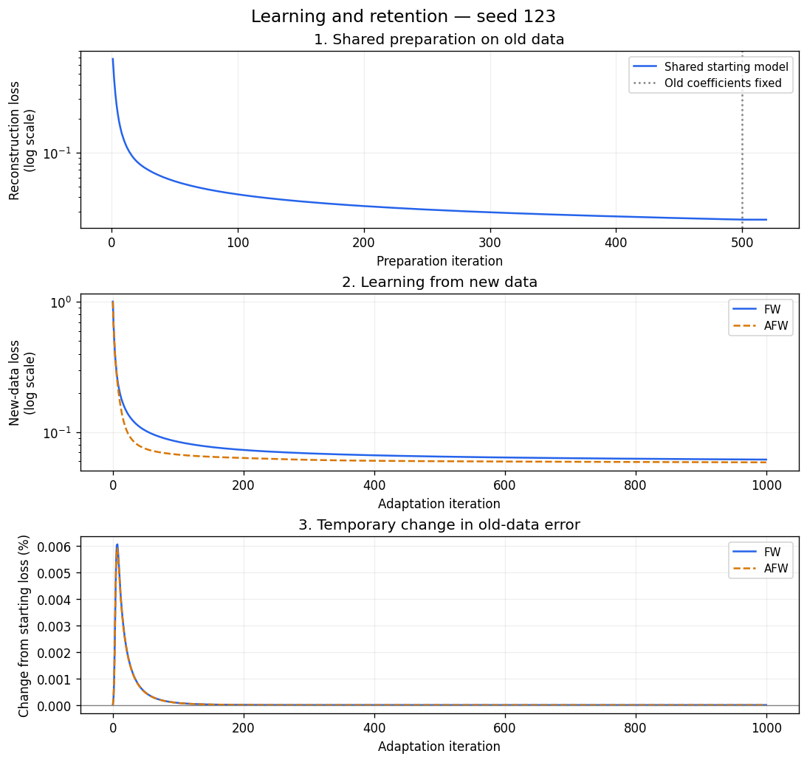
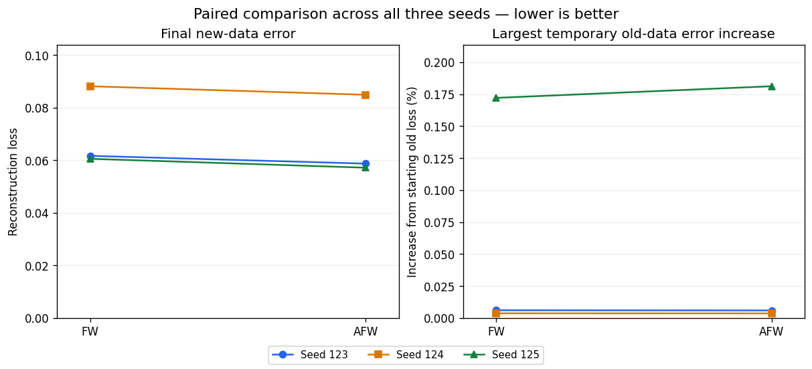

# Online Dictionary Learning and Bilevel Optimization

How can a model learn from new observations without losing its ability to represent the old ones? This university optimization project explores that question through **dictionary learning**, comparing **Frank–Wolfe (FW)** with an **Away-step Frank–Wolfe (AFW) variant**.

A dictionary is a collection of reusable vectors called **atoms**. Each observation is represented by a weighted combination of these atoms. The goal is to find a useful dictionary and sparse coefficients, then expand the dictionary when new data arrives.

**Main result:** from identical trained starting models, the AFW coefficient variant achieved **4.6% lower mean new-data reconstruction loss** than the FW coefficient variant across three synthetic runs. Old-data error rose slightly during adaptation and returned close to its starting value. This is a comparison of two alternating update methods, not proof that AFW is universally better.

**[Open the notebook](dictionary_learning.ipynb)** to explore the implementation, explanations, result tables, and saved plots. Everything can be read directly on GitHub.

## The learning problem

The experiment has two stages:

1. **Learn from old data:** fit a dictionary with 40 atoms and the coefficients needed to represent 250 observations.
2. **Adapt to new data:** expand the dictionary to 50 atoms and learn from 200 new observations, while using the old-data objective to guide dictionary updates.

This creates a bilevel learning problem: the **lower-level objective** describes how well the dictionary represents old data, and the **upper-level objective** describes how well it represents new data. The old coefficients remain fixed during adaptation.

```text
250 old observations → Learn 40 atoms and old coefficients
                                   ↓
                         Add 10 dictionary atoms
                                   ↓
200 new observations → Adapt the expanded dictionary
                         while tracking old-data loss
```

## Dataset

The data is generated locally with NumPy; no external download is needed.

| Property | Setting |
|---|---|
| Observations | 250 old + 200 new |
| Features per observation | 25 |
| Generating dictionary | 50 normalized atoms |
| Generating coefficients | Five nonzero entries per observation |
| Old-data atoms | Atoms 1–40 |
| New-data atoms | Atoms 31–50 |
| Gaussian noise | Standard deviation 0.01 |
| Random seeds | 123, 124, 125 |

The two batches share 10 generating atoms, while the new batch introduces another 10. This gives the model both familiar and unfamiliar structure to learn. The generating dictionary is used for data creation and evaluation only, never as a training input.

## Algorithms

Both methods minimize reconstruction error: the difference between the observed data and its approximation using the dictionary and coefficients.

| Method | Coefficient update |
|---|---|
| **Frank–Wolfe** | Moves towards a signed coordinate vector chosen using the gradient. |
| **Away-step Frank–Wolfe** | Also allows moving away from a previously selected vector, reducing its weight when that gives a better direction. |

AFW explicitly tracks the weights of selected vectors and limits its away steps to keep those weights valid. Both methods use the **same constrained FW dictionary update**; away steps apply only to the coefficient block. Coefficients and dictionary are updated in turn. This is an alternating block method, not full-space AFW or an exact implementation of the joint CG-BiO algorithm in the reference paper.

Dictionary columns have Euclidean norm at most 1. The absolute values in each coefficient vector sum to at most 3, encouraging sparse representations. This does not force the learned coefficients to contain exactly five nonzero entries.

During adaptation, a linear approximation of the old-data objective constrains the dictionary update. The linear subproblem is solved through a nonnegative multiplier, including cases where a combined gradient vanishes. The solver checks feasibility and the difference between primal and dual objective values. A linearized constraint can still allow temporary increases in the actual old loss, so both final and maximum changes are measured.

## Comparison setup

For each seed, the experiment prepares **one shared old-data model**:

1. Run 500 alternating FW coefficient and dictionary updates on the old observations.
2. Fix the old coefficients and refine the dictionary until its FW gap is at most `1e-7`, with a limit of 10,000 refinement steps. The gap bounds the remaining error for this convex dictionary-only problem; it does not certify the earlier joint, nonconvex training.
3. Add the same 10 random unit-norm atoms and extend the old coefficient matrix with zeros.
4. Give FW and AFW exact copies of this dictionary and these old coefficients. Each method then runs 1,000 online adaptation iterations, starting from zero new-data coefficients.

This ensures both methods solve **the same lower-level problem**, not just problems generated from the same data. The only online algorithmic difference is the choice of coefficient update.

Coefficient updates use an exact quadratic line search. Initial dictionary updates also use line search; online dictionary updates use the shared step schedule `0.3 / sqrt(iteration + 1)`.

The experiment compares reconstruction error, dictionary recovery, and online runtime. Three seeds provide a small sensitivity check, not a broad benchmark.

## Results

Values below are **mean ± sample standard deviation across the three seeds**. Reconstruction loss is the average half-squared error per observation; lower is better.

| Metric | FW | AFW |
|---|---:|---:|
| New-data reconstruction loss | 0.07017 ± 0.01563 | **0.06697 ± 0.01560** |
| Old-data loss before adaptation | 0.02446 ± 0.00396 | 0.02446 ± 0.00396 |
| Old-data loss after adaptation | 0.02446 ± 0.00396 | 0.02446 ± 0.00396 |
| Maximum temporary old-loss increase | 0.000012 ± 0.000019 | 0.000013 ± 0.000020 |
| One-to-one atom recovery | 36.0% ± 19.1% | 36.7% ± 19.0% |
| Online adaptation time | 1.93 ? 0.03 seconds | 1.96 ? 0.08 seconds |

The **4.6% reduction** compares the two mean new-data losses. AFW achieved a lower new-data loss in each of the three runs. These are training reconstruction results, not classification accuracy or performance on unseen data.

Old-data losses round to the same values before and after adaptation, but retention is not exact throughout. The largest temporary increase across all runs was approximately **0.0000365**. Each pair starts from exactly the same old-data model and is assessed against the same reference loss.



The first two panels use logarithmic loss axes. The third uses a linear axis and shows the percentage change relative to the starting old-data loss; positive values mean worse reconstruction. These curves show seed 123 only. Dashed and solid lines distinguish methods where their curves overlap.

Dictionary recovery uses a maximum-total-similarity **one-to-one assignment** between learned and generating atoms, then counts matches whose absolute cosine similarity exceeds 0.9. It ignores sign and ordering without reusing a learned atom. This is a diagnostic, not evidence of exact recovery.



Each line connects FW and AFW on the same seed and starting model. The left panel shows final new-data loss; the right shows the largest temporary increase in old-data loss as a percentage of its starting value. Lower is better in both panels. The right panel includes all seeds, so it also reveals retention changes not visible in the seed-123 example.

Timings cover online adaptation and its numerical checks with one numerical-library thread. Shared preparation, data generation, and plotting are excluded. Timings depend on the machine; three short runs do not establish a reliable speed advantage.

## Implementation checks

The notebook contains executable checks rather than relying only on successful plotting:

- Analytical gradients are compared with finite differences.
- FW and AFW are checked against known sparse-coding solutions, including a boundary solution.
- Coefficient weights, dictionary norms, and coefficient constraints are checked for validity.
- Dictionary linear subproblems are compared with an independent SciPy SLSQP solution on 10 small problems.
- A known zero-gradient case, a boundary constraint, and an infeasible constraint test the dictionary solver's edge cases.
- The recovery metric is checked for duplicate matches and unintended changes to its inputs.

The experiment also checks the lower-level optimality gap and the dictionary halfspace constraint. These checks support the implementation's numerical correctness; they do not prove convergence of the full nonconvex alternating method.

## What this project demonstrates

- Implementing gradient-based constrained optimization in NumPy.
- Understanding FW directions, AFW active weights, and feasible step sizes.
- Learning sparse representations and expanding a dictionary for new data.
- Studying the relationship between adaptation and retention in a bilevel formulation.
- Comparing convergence curves, reconstruction quality, atom recovery, and runtime.

## Limitations

The experiment uses one old batch and one new batch of synthetic data, rather than a continuous real-world stream. Joint dictionary and coefficient learning is nonconvex, and the lower-level solution is approximate. The comparison does not prove global convergence, exact atom recovery, or generalization to unseen observations. Testing real data and more seeds would be useful extensions.

## Run the project

Use **Python 3.12**, preferably in a virtual environment:

```bash
git clone https://github.com/ghaderi-m/Bilevel-Optimization-in-Online-Dictionary-Learning.git
cd Bilevel-Optimization-in-Online-Dictionary-Learning
python -m pip install -r requirements.txt
```

Open `dictionary_learning.ipynb` in VS Code with the Jupyter extension, or an existing Jupyter installation. Select the environment containing the dependencies and run the cells in order. The notebook generates the dataset and figures, runs all six fits, and includes numerical checks for the updates.

| File | Contents |
|---|---|
| [dictionary_learning.ipynb](dictionary_learning.ipynb) | Complete implementation, explanations, and saved results. |
| [figures/](figures/) | Data structure, convergence curves, and method comparison. |
| [requirements.txt](requirements.txt) | Pinned dependencies. |

**Tools:** Python, NumPy, SciPy, pandas, and Matplotlib.

## References

- [Jiang et al. (2023): A Conditional Gradient-based Method for Simple Bilevel Optimization with Convex Lower-level Problem](https://proceedings.mlr.press/v206/jiang23a.html) — a related formulation for online dictionary learning; this project is not an exact reproduction of its experiments.
- [Lacoste-Julien and Jaggi (2015): On the Global Linear Convergence of Frank-Wolfe Optimization Variants](https://arxiv.org/abs/1511.05932) — background on FW and away-step updates. Its theoretical convergence rates are not claimed for the full experiment here.
